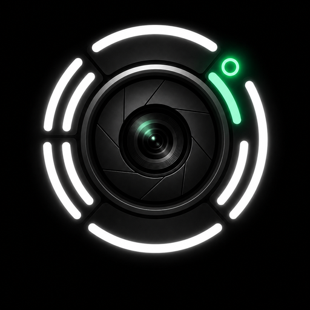
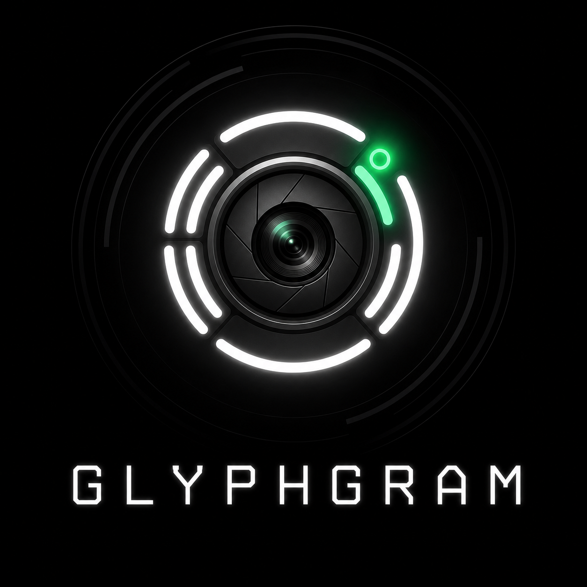

  
  <h1>GlyphGram</h1>
  
Glyph Interface lighting for Telegram round-video messages on Nothing Phone (2).

  
<strong>Created by <a href="https://t.me/M0zy1">@M0zy1</a></strong>

## What it does

GlyphGram adds a `✦` button to the round-video camera in AyuGram. When armed,
the plugin turns on the rear Glyph Interface while a video message is being
recorded and turns it off afterward.

The project consists of two parts:

- `plugin/GlyphGram.plugin` — AyuGram/exteraGram Python plugin;
- `companion/` — a small Android app using Nothing's official Glyph Developer Kit.

The companion is necessary because AyuGram itself does not declare Nothing's
`com.nothing.ketchum.permission.ENABLE` permission.

## Compatibility

The current release was tested with:

- Nothing Phone (2);
- Nothing OS 4.1 / Android 16;
- AyuGram 12.5.1, package `com.radolyn.ayugram`.

Other phones, ROMs, or AyuGram versions are not currently supported.

## Installation

Download these two files from the latest GitHub Release:

- `GlyphGram-Companion-1.0.0.apk`;
- `GlyphGram-1.0.1.plugin`.

Then:

1. Install and open the Companion.
2. Press **Turn Glyph on**, confirm that all Glyph zones light up, then press
   **Turn Glyph off**.
3. In AyuGram, open **Settings → exteraGram settings → Plugins**.
4. Enable the plugin system, import `GlyphGram-1.0.1.plugin`, and enable it.
5. Fully restart AyuGram.
6. Open the round-video camera. Tap `✦`; green means that Glyph lighting is armed.

## Building the companion

Requirements:

- Android Studio or JDK 17 + Gradle;
- Android SDK 36;
- official Nothing Glyph Developer Kit AAR.

Place the GDK AAR at
`companion/app/libs/glyph-matrix-sdk-2.0.aar`, open `companion/` in Android
Studio, and build the `app` module. Release APKs must be signed with your own
keystore. Signing keys are intentionally excluded from the repository.

## Building the plugin

No compilation is required. Import `plugin/GlyphGram.plugin` directly into
AyuGram. Plugin metadata points to sticker `GlyphGram/0` from the
[GlyphGram sticker pack](https://t.me/addstickers/GlyphGram).

## Safety and privacy

- No internet permission is requested by the Companion.
- No analytics, tracking, or user-data collection is included.
- A foreground service and visible notification are used while Glyph is active.
- The plugin sends an explicit OFF command on send, cancel, camera close, and unload.

This is an independent community project. It is not affiliated with or
endorsed by Nothing, Telegram, AyuGram, or exteraGram.

## License

Project source code is available under the [MIT License](LICENSE). Nothing's
Glyph Developer Kit remains subject to Nothing's own terms and is not included
in the source repository.

---

Описание на русском

GlyphGram добавляет кнопку подсветки Glyph в интерфейс записи кружков AyuGram
на Nothing Phone (2). Для работы сначала установите Companion APK, проверьте
подсветку кнопками в приложении, затем импортируйте файл `.plugin` в AyuGram и
полностью перезапустите клиент. Зелёная кнопка `✦` означает, что подсветка
включится во время записи.

